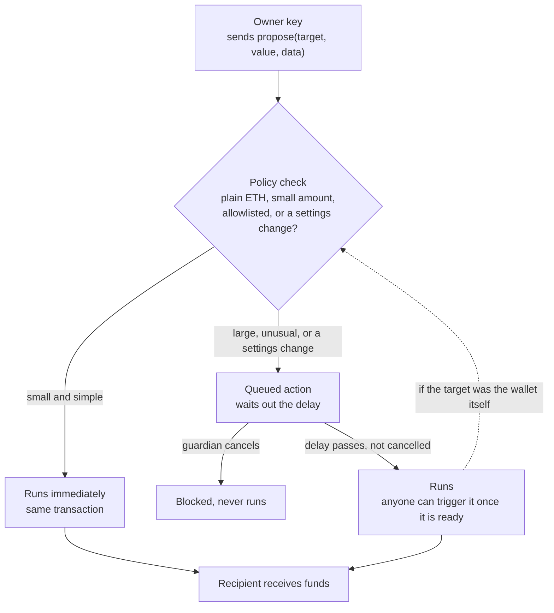

# Vigil

Vigil is a smart contract wallet that adds a simple safety check in front of every transfer. Small, everyday payments go through right away. Large or unusual transfers are held for a short waiting period, and a second key can cancel them before they go through. Even turning this protection off has to go through the same waiting period, so a stolen key alone is not enough to empty the wallet.

Live demo: https://vigil-beige-psi.vercel.app, running against a real wallet on the Sepolia test network.

## The problem this solves

Most wallets are protected by a single private key. If that key is stolen, phished, or leaked, the funds behind it are gone in one transaction. Multi signature wallets fix this by needing several people to approve every transaction, which is safe but slow and annoying for normal spending. Vigil tries a different balance: keep spending fast for normal use, but slow down and add a human check for anything that looks like it could drain the wallet.

## How it works

Every transfer request goes through one function on the contract, called propose. The contract then decides what happens next.

* If the transfer is a plain payment of ETH, under a set amount, and the wallet has not moved too much money recently, it happens immediately, in the same transaction.
* If the recipient is on a trusted list the owner set up earlier, it also happens immediately, with no limit.
* Anything else, meaning a large transfer, a call to another contract, or a request to change the wallet's own settings, is placed in a queue. It has to wait out a delay before it can run, and it can be cancelled during that wait.

A second key, called the guardian, can cancel any queued action before it runs. The guardian can never move money on its own. It can only say no to something the owner already asked for.

The important part is what happens when someone tries to turn this protection off. Changing the delay, changing the spending limit, changing the guardian, or disabling the whole system are treated exactly like a large transfer. They get queued, they wait out the delay, and they can be cancelled. So even if an attacker has full control of the owner's key, they cannot quietly switch off the protection and then drain the wallet. Removing the safety net is itself something the safety net protects.



Because a settings change loops back into the same policy check, disabling Vigil is never a shortcut around Vigil.

## What it is useful for

* Everyday spending from a wallet you still hold the keys to, without waiting on a delay for every small purchase.
* Holding savings in a wallet where a single leaked key is a scare, not a loss.
* Giving a second device, a co founder, or a family member a key that can only block bad transactions, never make its own.
* Learning how a minimal circuit breaker for a wallet could be built, since the whole policy lives in one readable contract.

## Project layout

```
contracts/   Foundry project with VigilVault.sol, its tests, and the deploy script
demo/        Shell scripts that run the whole demo against a local chain
web/         Next.js dashboard and landing page
```

## Running it locally

You need Foundry and Node.js 20 or newer.

```bash
# first time only, pull in the contract dependencies
cd contracts && forge install foundry-rs/forge-std OpenZeppelin/openzeppelin-contracts --no-git && cd ..

# terminal one, start a local chain and leave it running
demo/start-chain.sh

# terminal two, deploy a fresh wallet funded with test ETH
demo/deploy.sh

# terminal two, start the dashboard
cd web && npm install && npm run dev
# open http://localhost:3000

# terminal three, try to drain the wallet using the owner's key
demo/attack.sh
# then click VETO on the dashboard, or run demo/veto.sh <actionId>
```

`demo/reset.sh` restarts the chain and deploys a fresh wallet in one step, useful between test runs.

Every private key used anywhere in this project is one of Anvil's public test keys. They are the same on every machine, they hold no real value, and they should never be used to hold real funds.

## Tests

```bash
cd contracts
forge test
```

Eighteen tests cover the instant path, the queue, cancelling, the spending limit, and the recursive protection around the settings themselves.

## Technology used

Solidity and Foundry for the contract, tests, and deployment. OpenZeppelin for the reentrancy guard. Next.js, React, TypeScript, Tailwind CSS, and viem for the dashboard. Plain shell scripts for the demo.
